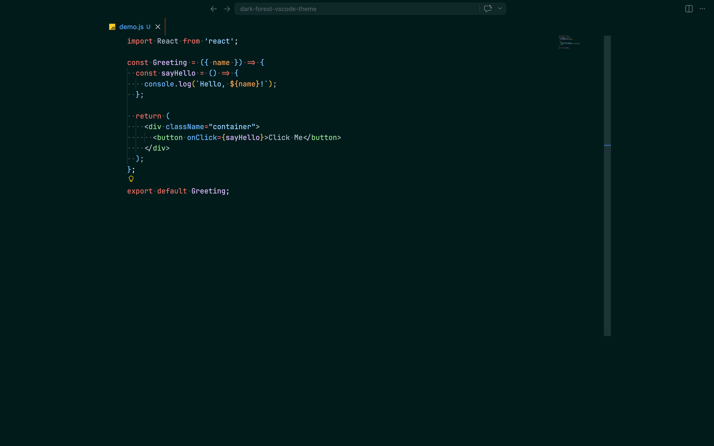
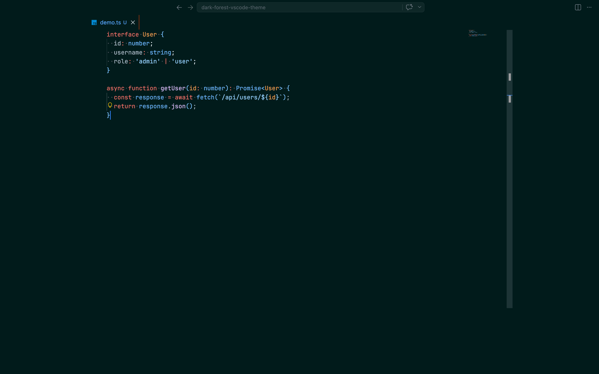
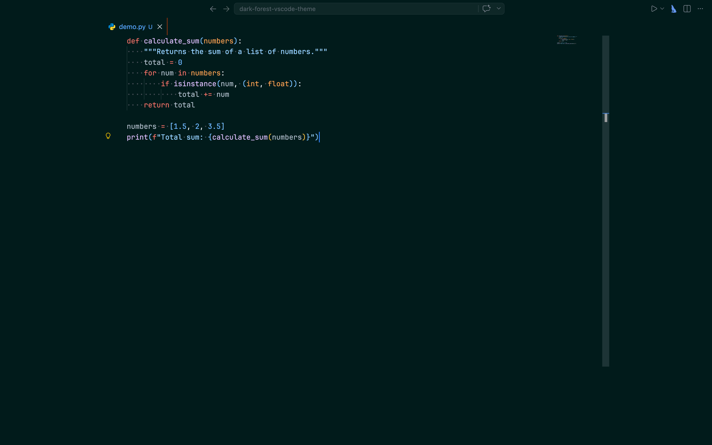
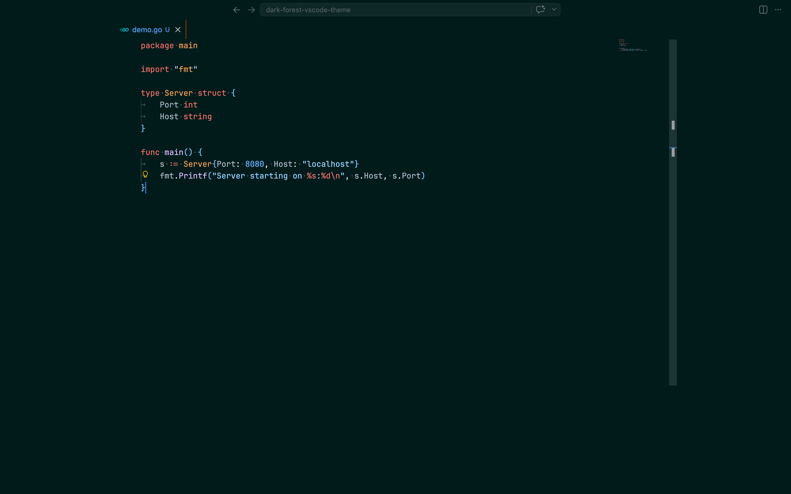
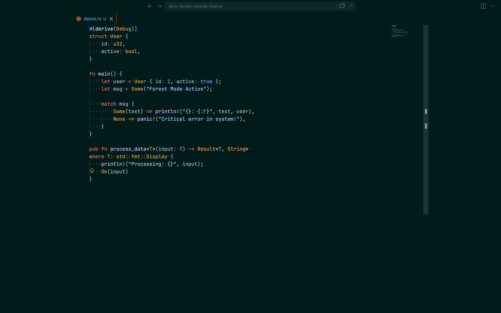
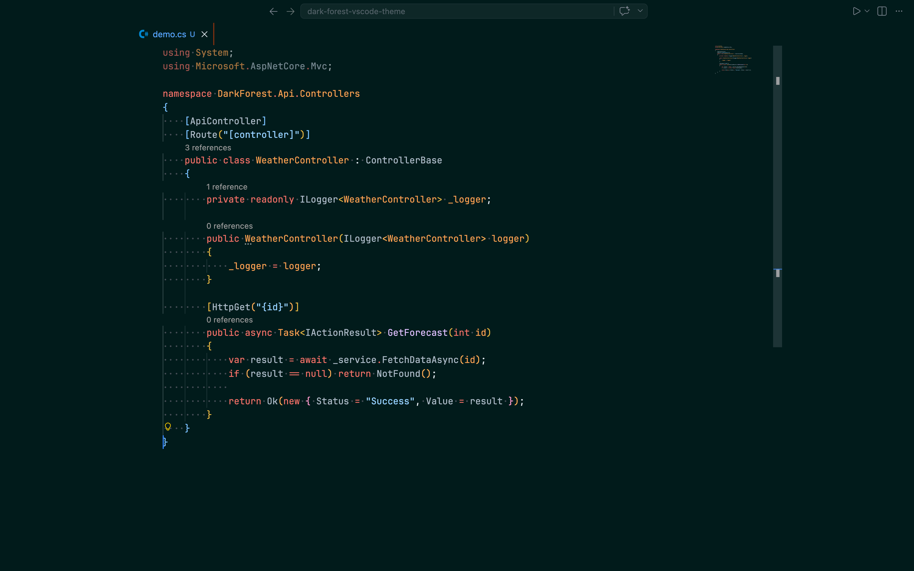
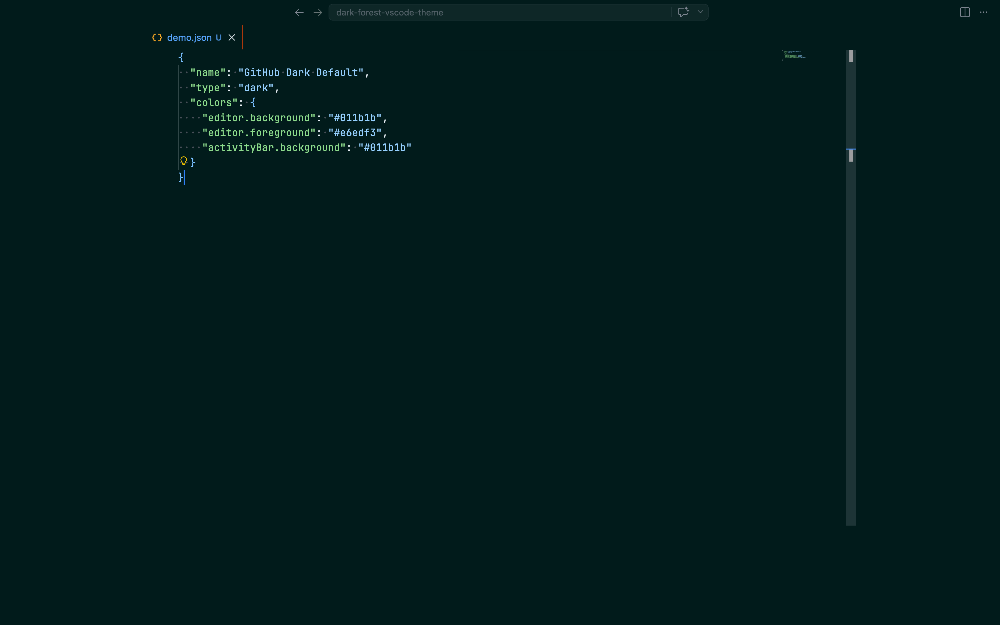
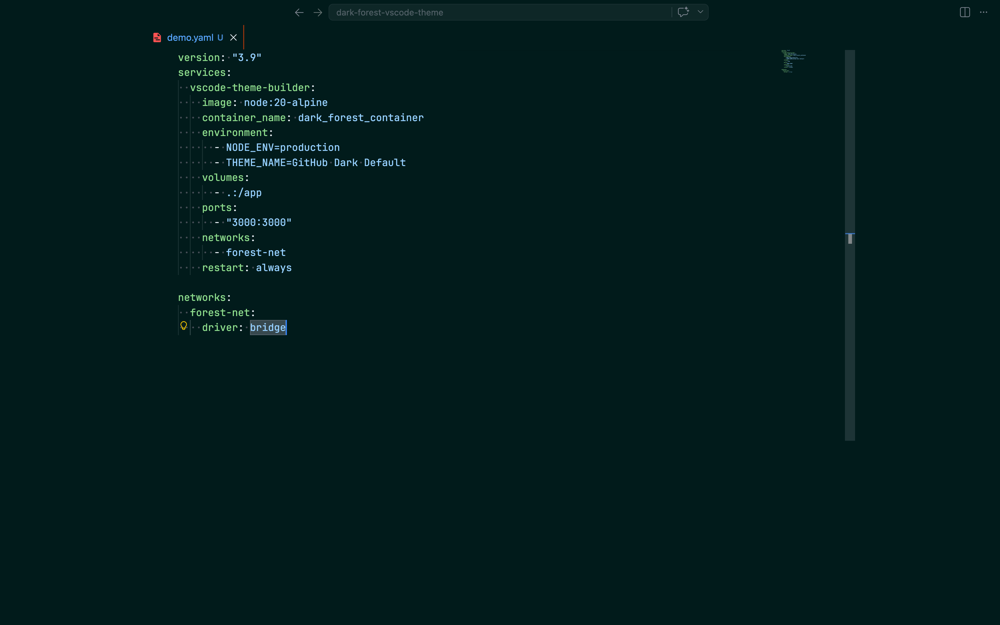

# Dark Forest Theme

Dark forest-themed VS Code theme with deep teal hues and vibrant orange accents.

## Installation

### From VS Code Marketplace
1. Open **Extensions** sidebar in VS Code (`Ctrl+Shift+X` or `Cmd+Shift+X`)
2. Search for `Dark Forest`
3. Click **Install**
4. Go to **Settings** → **Color Theme** and select `dark-forest`

### JavaScript

### TypeScript

### Python

### Go

### Rust

### C#

### JSON

### YAML

